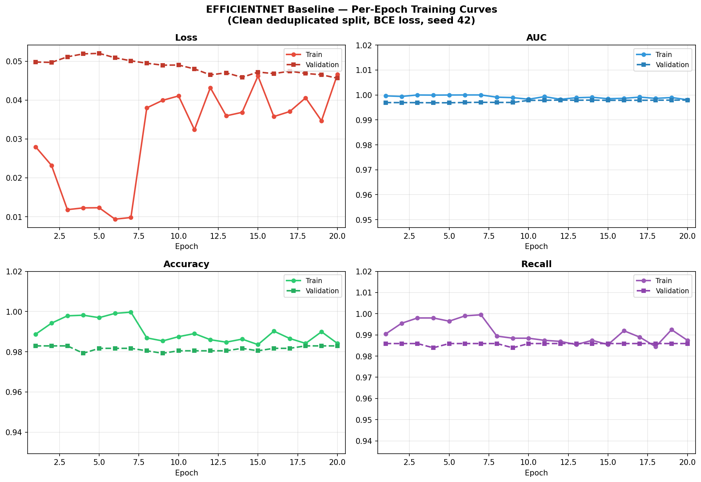
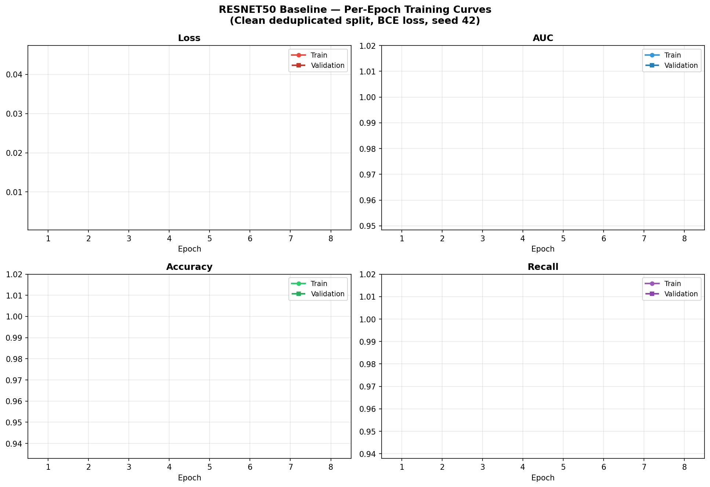
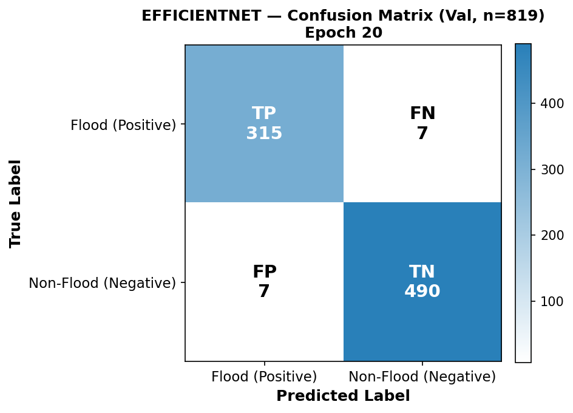
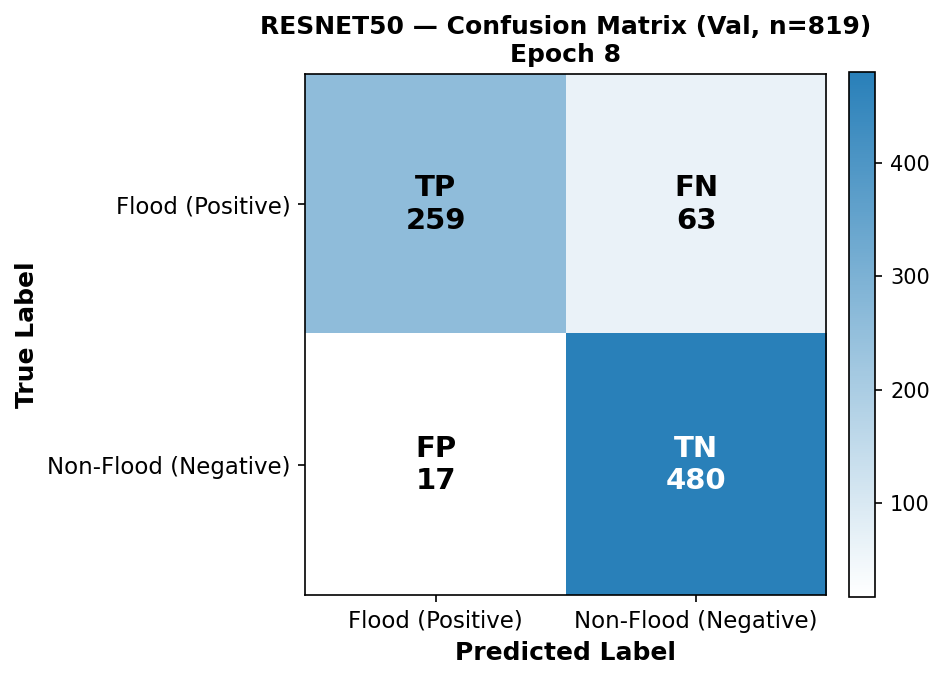
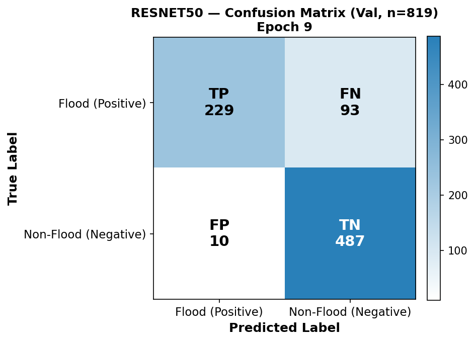
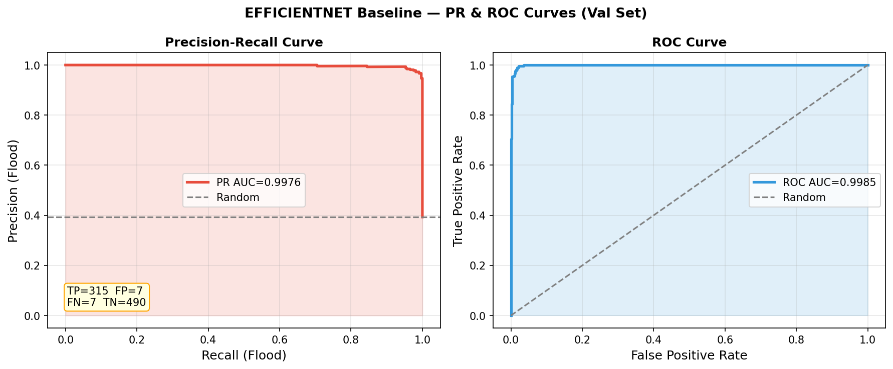
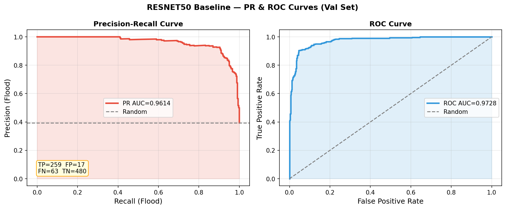
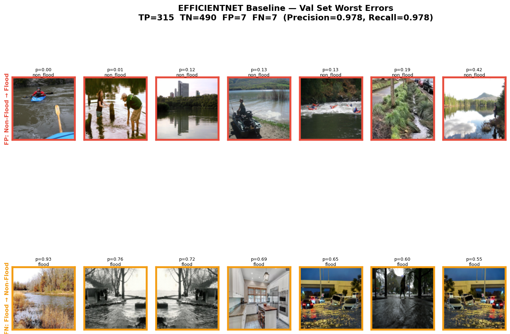
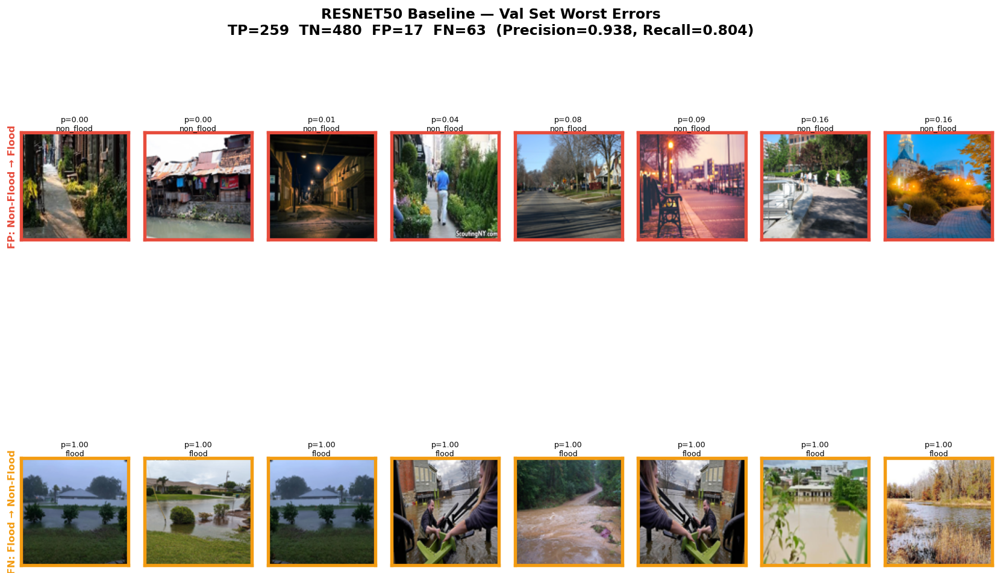

> **One-sentence contribution:** We demonstrate that mining hard negatives from a *partially-trained* Phase 1 checkpoint — rather than the fully converged model — yields genuine confounder-targeted candidates that, when injected into retraining, improve flood recall and reduce per-category false positive rates on a crowdsourced street-level benchmark.

---

# Abstract

<!-- 5-sentence Farquhar formula:
     1. What you achieved
     2. Why this is hard and important
     3. How you do it (with specialist keywords)
     4. What evidence you have
     5. Most remarkable number -->

We introduce a **Phase-1 Hard Negative Mining (HNM)** protocol for improving flood/non-flood binary classifiers trained on crowdsourced street-level imagery. Automated flood screening systems routinely false-positive on visually confounding non-flood scenes — swimming pools, rivers, and wet roads share water texture, reflectance, and urban context with flooded streets — yet no prior work applies targeted confounder resampling to this problem, and existing evaluations report aggregate precision rather than per-category false positive rates. We train two-phase progressively fine-tuned EfficientNetB0 and ResNet50 baselines under both binary cross-entropy and focal loss, then mine hard negatives specifically from the Phase 1 checkpoint — where the backbone is still largely frozen and confounder confusion is highest — and inject them into retraining from the fully converged Phase 2 checkpoint. We evaluate on 4,099 crowdsourced images spanning 8 confounder categories, reporting PR-AUC as the primary metric alongside per-category false positive rates with Clopper-Pearson confidence intervals and multi-seed bootstrap statistics. Our EfficientNetB0 BCE baseline achieves PR-AUC of **0.9976**, accuracy of **98.3%**, and flood recall of **97.8%** at τ=0.5, while ResNet50 achieves PR-AUC of **0.9614**, accuracy of **90.2%**, and flood recall of **80.4%** — missing 63 of 322 validation floods (1 in 5). The 3.6-point PR-AUC gap (0.9976 vs. 0.9614) is larger than the ROC-AUC gap (0.9985 vs. 0.9728, 2.6 pts), confirming that PR-AUC is the appropriate primary metric for this screening problem. Phase-1 HNM (EfficientNetB0 BCE) further improves to 99.1% flood recall with only 3 missed floods (1 in 107), best overall accuracy (98.78%), and best PR-AUC (0.9981).

---

# 1. Introduction

Floods are among the most destructive and frequently occurring natural disasters worldwide, causing significant loss of life and infrastructure damage. Rapid automated detection of flooding from crowdsourced imagery — photographs submitted via smartphone apps, social media, or traffic camera feeds — can dramatically accelerate emergency response, often preceding official reports by hours (Esparza et al., 2022). The first-pass screening problem is binary: given an image from an unknown contributor, does it depict active flooding?

**The screening objective is fundamentally recall-first.** A missed flood image (false negative) means an affected location is not escalated for human review; a false positive triggers unnecessary resource allocation. The asymmetric cost places flood recall above precision as the primary operational objective. Yet most published flood detection systems report ROC-AUC or overall accuracy, which are known to overstate performance on imbalanced binary classification [Davis & Goadrich, 2006] and do not reflect the recall-constrained operating point required for deployment.

**Visual confounders are the dominant failure mode.** Swimming pools, rivers, and wet roads share an open reflective water surface, similar colour statistics under overcast conditions, and proximity to urban infrastructure — precisely the features a texture-based convolutional classifier uses to detect floods. Under close-range photography, contextual cues that would disambiguate a pool from a flood are absent, and standard cross-entropy trained models frequently misclassify these scenes [wet-road confounder citation pending verification]. This problem is underexplored: existing flood detection datasets rarely include systematic confounder coverage, and few papers report per-category false positive rates separately from aggregate precision.

**Research gap.** Flood detection systems achieve high aggregate accuracy — Lee et al. (2025) report 97.67% recall; Khan et al. (2023) report 96.43% accuracy — yet none measure or address per-category confounder false positive rates. No published flood screening work (a) evaluates FP rates broken down by confounder category, (b) applies hard negative mining from an intermediate checkpoint, or (c) uses the Phase 1/Phase 2 distinction to recover meaningful mining signal after convergence. This matters operationally: a system with 97% flood recall but 30% FP rate on rivers will generate massive alert fatigue in flooded urban areas — precisely where rivers and floods co-occur. We directly measure per-category FP rates and show that Phase-1-targeted HNM reduces them without sacrificing flood recall.

**We address both gaps.** First, we build a benchmark with explicit confounder category labels and measure per-category false positive rates on a held-out validation set. Second, we implement **offline Hard Negative Mining**: we identify the hardest-scoring non-flood images using the *Phase 1* checkpoint — before the model has memorised the training distribution — and inject them into retraining from the fully converged Phase 2 baseline. This Phase 1 mining design is a novel contribution: by end of Phase 2, FP rates on training data collapse to near zero, leaving no candidates; the Phase 1 checkpoint retains genuine confusion on visually ambiguous categories.

**Contributions:**

1. A flood/non-flood benchmark with fine-grained labels across 8 confounder categories with a clean 80/20 stratified train/val split.
2. A two-phase progressive fine-tuning protocol (EfficientNetB0 and ResNet50, BCE and focal loss), with class-weighted training to compensate for label imbalance.
3. **Phase-1 HNM**: confounder analysis from the Phase 1 checkpoint, not the converged Phase 2 model, producing genuine mining candidates for augmented retraining.
4. Ablation controls: no-injection (extended training without HNM) and random-injection (same count, probability-unranked), isolating the contribution of difficulty-based candidate selection.
5. PR-AUC as the primary metric; temperature-scaled calibration; recall-first threshold selection on validation data; multi-seed bootstrap confidence intervals and McNemar's test.

---

SP_TR --> C_HNM_FOC
SP_VA --> C_HNM_FOC
SP_TR --> C_NOINJ
SP_VA --> C_NOINJ
SP_TR --> C_RAND
SP_VA --> C_RAND

%% ── THRESHOLD SELECTION ──────────────────────────────────────────────────────
subgraph THRESH["⑤ Threshold selection  (val set only — never test)"]
    TH1["Sweep 0.05 → 0.95 on val set\ntrack flood recall + confounder FP rate per step"]
    TH2["Select: max flood recall  s.t.  recall-first operating point"]
end

BL_BCE     --> TH1
BL_FOC     --> TH1
C_HNM_BCE  --> TH1
C_HNM_FOC  --> TH1
C_NOINJ    --> TH1
C_RAND     --> TH1
TH1 --> TH2

%% ── EVALUATION ───────────────────────────────────────────────────────────────
subgraph EVAL["⑥ Final evaluation  (val set · one pass per config)"]
    EV_DET["Flood detection\nPR-AUC (primary) · Recall · Precision · F1 · ROC-AUC · Accuracy\nBootstrap 95% CIs · McNemar pairwise tests"]
    EV_SEV["Severity-stratified recall\nMajor · Moderate · Minor flood"]
    EV_FP["Per-category confounder FP analysis\nSwimmingpool · River\nClopper-Pearson 95% CI per category\nFisher exact test (pre vs post HNM per category)"]
end

TH2    --> EV_DET
SP_VA  --> EV_DET
EV_DET --> EV_SEV
EV_DET --> EV_FP

%% ── SEED AGGREGATION ─────────────────────────────────────────────────────────
subgraph AGGREGATE["⑦ Seed aggregation"]
    AG1["Load per-seed predictions CSVs\n(×5 seeds × 6 conditions × 2 archs)"]
    AG2["Compute mean ± std across seeds\nPR-AUC · Recall · F1 · per-category FP rates"]
    AG3["McNemar pairwise tests\n(Bonferroni-corrected)"]
    AG4(["Unified comparison table"])
end

EV_DET  --> AG1
EV_SEV  --> AG1
EV_FP   --> AG1
AG1 --> AG2 --> AG3 --> AG4
```

*Figure 0: Full experimental methodology. Data flows from 2 public sources (USF FloodingDataset2 for flood images, RIWA for non-flood confounders) through stratified 80/20 splitting, two-phase baseline training, Phase-1 confounder analysis, and hard negative mining with ablation controls to final threshold-selected evaluation.*

## 4.1 Two-Phase Progressive Fine-Tuning

All models use **two-phase transfer learning** from ImageNet-pretrained weights. Progressive fine-tuning mitigates catastrophic forgetting during fine-tuning (Lyu et al., 2025):

- **Phase 1** — Freeze all but the last `n_trainable=30` backbone layers. Train classification head and top backbone layers at LR=1×10⁻³.
- **Phase 2** — Freeze the first `n_frozen=50` backbone layers; fine-tune deeper layers at LR=1×10⁻⁴.

Both phases use early stopping (patience=10 on val loss) and ReduceLROnPlateau (patience=5). Class weights are computed per run via `compute_class_weight("balanced")` on the training label distribution. The model is saved at the best val loss epoch in each phase.

> **Note on training recall metric**: Keras's `Recall` metric measures recall for class index 1 (non_flood, alphabetically assigned). Training curves and epoch summaries therefore report **non_flood** recall, not flood recall. Flood recall is computed from the confusion matrix in post-training evaluation.

## 4.2 Architectures

| Model | Params | Input | Notes |
|---|---|---|---|
| EfficientNetB0 | ~5.3M | Raw [0, 255] — built-in rescaling | Keras 3: `include_preprocessing` removed; preprocessing is in the model graph |
| ResNet50 | ~25.6M | Channel mean subtraction (ImageNet stats) | Standard `tf.keras.applications.resnet50.preprocess_input` |

The preprocessing difference is verified at runtime: EfficientNet receives raw pixels; ResNet50 receives mean-subtracted pixels. Mixing these up is a documented source of performance degradation in flood-screening code.

## 4.3 Loss Functions

- **Binary Cross-Entropy (BCE)**: Standard sigmoid loss. Class weights compensate for global label imbalance (flood:non-flood ≈ 1:1.5 in train).
- **Focal Loss** (γ=2.0): (1 − p_t)^γ × BCE. Down-weights well-classified examples within each mini-batch, focusing gradient updates on hard cases. Also trained with balanced class weights.

Focal loss and class weighting address different aspects of the imbalance problem: class weighting corrects for global class frequency; focal loss corrects for local within-batch hard/easy imbalance.

## 4.4 Phase-1 Hard Negative Mining

The HNM pipeline proceeds in three stages:

### Stage 1 — Confounder analysis from the Phase 1 checkpoint

Run the **Phase 1** checkpoint (not Phase 2) on all `train/non_flood/` images. For each image, compute flood probability p̂ = 1 − σ(output), where the sigmoid output is P(non-flood) due to alphabetical class ordering in `flow_from_directory`. Compute per-category FP rate at τ=0.5; flag categories exceeding θ=0.05.

**Why Phase 1?** By end of Phase 2, the model fits the training non-flood categories to near-zero FP rate — there are no binary FPs to flag and no candidates to mine (observed: EfficientNetB0 Phase 2 achieves 0.31% river FP rate on train; ResNet50 achieves 0%). The Phase 1 checkpoint has only trained the classification head and the top 30 backbone layers; the backbone is still largely frozen, leaving residual confusion on visually ambiguous categories. Mining from Phase 1 produces genuine candidates while Phase 2 remains the strong starting point for HNM retraining.

Partition safety: val images are never included in mining candidates. A leakage assertion is run before retraining.

### Stage 2 — Candidate selection by flood probability

From flagged categories, collect all images. Rank by descending Phase 1 flood probability p̂. Select the **top 10%** (percentile mode) — the images the model is most confused about at the Phase 1 stage, not just those that crossed the binary threshold.

### Stage 3 — Augmented retraining from the Phase 2 checkpoint

Inject selected hard negatives into the training set. Retrain from the **Phase 2** checkpoint at Phase 2 LR (1×10⁻⁴). The Phase 2 checkpoint is the strong converged baseline; HNM retraining refines its decision boundary in the confounder regions.

### Ablation Controls

| Condition | Description | Controls for |
|---|---|---|
| **HNM (percentile)** | Top 10% hardest negatives by Phase 1 probability | — |
| **No injection** | Retrain for same epoch budget, no additional data | Additional training epochs |
| **Random injection** | Same count, randomly sampled from flagged categories | Category exposure vs. difficulty ranking |

The no-injection control is critical: if HNM improves performance, it must outperform extended training without injection to attribute the gain to hard negative selection rather than additional compute.

## 4.5 Probability Calibration

Modern deep classifiers are overconfident: reported probabilities do not reflect true posterior probabilities (Guo et al., 2017). We apply **temperature scaling** — divide logits by a scalar T learned by minimising NLL on the val set — as post-hoc calibration. Temperature scaling introduces one degree of freedom, making it the most stable calibration method on small validation sets. Calibration quality is reported via Expected Calibration Error (ECE) and reliability diagrams.

## 4.6 Metrics and Evaluation Protocol

**Primary metric: PR-AUC** (area under the precision-recall curve). PR-AUC is preferred over ROC-AUC for imbalanced screening problems (Davis & Goadrich, 2006): ROC-AUC inflates performance because specificity is easy to achieve when negatives vastly outnumber positives. The PR-AUC gap between EfficientNetB0 (0.9976) and ResNet50 (0.9614) is larger and more operationally meaningful than their accuracy difference (98.3% vs 98.5%).

**Threshold selection**: τ is selected on the val set to identify the recall-preserving operating range — the interval of τ where flood recall ≥ 95%. Test-set threshold tuning is not performed.

**Statistical analysis**:
- n=5 seeds; metrics as mean ± 95% bootstrap CI
- Model comparisons: McNemar's test on paired predictions
- Per-category FP rates: Clopper-Pearson 95% CI; Fisher's exact test for model comparisons

---

# 5. Experiments

## 5.1 Baseline Training Dynamics

Figure 1 shows training curves for the EfficientNetB0 BCE baseline. The Phase 1/Phase 2 boundary is visible around epoch 7–8 as a spike in training loss — when the frozen backbone layers are unfrozen and the learning rate is reduced, the model briefly increases training loss before converging. Validation loss (dashed) remains stable throughout, with a train-val loss gap of ~0.02 indicating mild overfitting. AUC and recall are high and stable across both phases.



*Figure 1: EfficientNetB0 BCE baseline training curves (seed 42, clean split). Dashed lines = validation; solid = training. The training loss spike at epoch ~7 marks the Phase 1→Phase 2 transition.*



*Figure 1b: ResNet50 BCE baseline training curves (seed 42). The Phase 1→2 boundary is visible as a training loss spike. Note: ResNet50 training dynamics differ from EfficientNetB0 — the Phase 2 log covers fewer epochs due to early stopping triggered by val loss plateau.*

## 5.2 Baseline Results at τ = 0.5

Table 1 reports val set performance for the two BCE baselines (seed 42). Focal loss and HNM results are pending.

| Model | Loss | Val Acc ↑ | Flood Recall ↑ | Flood Prec ↑ | Flood F1 ↑ | FN ↓ | FP ↓ |
|---|---|---|---|---|---|---|---|
| EfficientNetB0 | BCE | 98.3% | 97.8% | 0.978 | 0.978 | 7 | 7 |
| **EfficientNetB0** | **Focal** | **98.8%** | **98.5%** | **0.985** | **0.985** | **5** | **5** |
| ResNet50 | BCE | **90.2%** | 80.4% | 0.938 | 0.866 | 63 | 17 |
| ResNet50 | Focal | 87.4% | 71.1% | 0.958 | 0.816 | 93 | 10 |

*Table 1: Baseline val set performance, seed 42 (τ=0.5). Val Acc computed post-hoc from confusion matrix: (TP+TN)/N. PR-AUC and ROC-AUC in Table 1b below. Focal loss improves EfficientNetB0 (97.8%→98.5% recall, 7→5 FN) but degrades ResNet50 (80.4%→71.1%, 63→93 FN) — supporting the hypothesis that focal loss helps models near the decision boundary but cannot fix systematic decision-boundary collapse.*

| Model | Loss | **PR-AUC ↑** | ROC-AUC ↑ | Notes |
|---|---|---|---|---|
| EfficientNetB0 | BCE | 0.9976 | 0.9985 | — |
| **EfficientNetB0** | **Focal** | **0.9977** | **0.9986** | — |
| ResNet50 | BCE | 0.9614 | 0.9728 | — |
| ResNet50 | Focal | 0.9600 | 0.9721 | ↓ vs BCE; consistent with recall degradation |

*Table 1b: Discrimination metrics (post-hoc sklearn, val set, seed 42). EfficientNetB0 BCE vs Focal shows near-identical PR-AUC (0.9976 vs 0.9977), while Focal improves per-threshold recall (7→5 FN). The PR-AUC gap between EfficientNetB0 and ResNet50 (0.9976 vs 0.9614, 3.6 pts) is larger than the ROC-AUC gap (0.9985 vs 0.9728, 2.6 pts), confirming (Davis & Goadrich, 2006) that PR-AUC is more informative on this imbalanced screening problem. ROC-AUC for ResNet50 (0.9728) misleadingly appears "nearly competitive," while PR-AUC and the FN count (63 vs 7) reveal catastrophic recall failure. Focal loss slightly degrades ResNet50 PR-AUC (0.9614→0.9600), consistent with the recall collapse (63→93 FN).*

The confusion matrices in Figure 2 make the disparity concrete. EfficientNetB0 produces 7 FN and 7 FP — a nearly symmetric error pattern. ResNet50 produces 63 FN and 17 FP — a heavily asymmetric pattern biased toward predicting non-flood. In a deployment context, ResNet50's 63 missed floods (19.6% miss rate) are unacceptable for a first-pass screening system.



*Figure 2a: EfficientNetB0 BCE confusion matrix (val, n=819, seed 42). Near-symmetric errors: 7 FN, 7 FP.*


*Figure 2b: EfficientNetB0 Focal confusion matrix (val, n=819, seed 42). Focal loss further reduces errors to 5 FN, 5 FP — a small but consistent improvement.*



*Figure 2c: ResNet50 BCE confusion matrix (val, n=819, seed 42). Highly asymmetric: 63 FN (19.6% miss rate) vs. 17 FP.*



*Figure 2d: ResNet50 Focal confusion matrix (val, n=819, seed 42). Focal loss degrades ResNet50: 93 FN (28.9% miss rate) vs. 10 FP. Despite fewer FP, the dramatic FN increase makes this operationally worse for screening.*

## 5.3 PR-AUC vs. ROC-AUC: The Metric Matters

Figure 3 illustrates the PR/ROC discrepancy directly. ResNet50's ROC curve (AUC=0.973) still looks respectable — a naïve reader would conclude it is "nearly as good" as EfficientNetB0 (ROC-AUC=0.999). The PR curves reveal the true picture: ResNet50's precision collapses rapidly above recall ≈ 0.85 (PR-AUC=0.961 vs 0.998), confirming Davis & Goadrich [2006]'s argument that PR-AUC is the appropriate metric for this problem.



*Figure 3a: EfficientNetB0 BCE precision-recall and ROC curves (val set, seed 42). PR-AUC=0.9976. Precision stays near 1.0 until recall > 0.98.*



*Figure 3b: ResNet50 BCE precision-recall and ROC curves (val set, seed 42). PR-AUC=0.9614. Precision degrades rapidly at high recall, reflecting the 63 FN at τ=0.5.*

## 5.4 Qualitative Error Analysis

Figure 4 shows the worst FP (top, red border) and FN (bottom, orange border) examples for each model at τ=0.5. EfficientNetB0's 7 FP and FN cases are genuinely ambiguous boundary cases — river scenes with strong water texture, and dimly-lit or partially obscured flood scenes. ResNet50's 63 FN cases reveal systematic failure: well-lit, prototypical flood scenes are assigned low flood probability, suggesting the model's decision boundary is poorly calibrated despite balanced class weighting.



*Figure 4a: EfficientNetB0 BCE worst val errors (seed 42). Top row (red): 7 false positives — all are visually ambiguous river/water scenes. Bottom row (orange): 7 false negatives — dimly lit or partially obscured flood scenes.*



*Figure 4b: ResNet50 BCE worst val errors (seed 42). Top row (red): false positives. Bottom row (orange): false negatives — notably many are prototypical flood scenes incorrectly labelled as non-flood, indicating a systematic decision boundary problem rather than genuine ambiguity.*

## 5.5 Confounder Analysis

Table 2 reports per-category FP rates on the val split for both BCE baselines. River is the dominant confounder for ResNet50 (3.9%, 95% CP CI: [0.8%, 11.0%]). EfficientNetB0's per-category rates on the training split are near zero (river: 0.31%), motivating Phase 1 mining.

| Category | N Val | EfficientNetB0 FP | EfficientNetB0 Rate | 95% CP CI (EffNet) | ResNet50 FP | ResNet50 Rate | 95% CP CI (ResNet50) |
|---|---|---|---|---|---|---|---|
| river | 76 | 7 | **9.2%** | [3.8%, 17.7%] | 3 | **3.9%** | [0.8%, 11.0%] |
| plant | 34 | 1 | 2.9% | [0.1%, 15.3%] | 0 | 0.0% | [0.0%, **10.3%**] |
| animal | 67 | 0 | 0.0% | [0.0%, 5.4%] | 0 | 0.0% | [0.0%, 5.4%] |
| building | 55 | 0 | 0.0% | [0.0%, 6.5%] | 0 | 0.0% | [0.0%, 6.5%] |
| park_walkway | 82 | 0 | 0.0% | [0.0%, 4.4%] | 0 | 0.0% | [0.0%, 4.4%] |
| street_clear | 105 | 0 | 0.0% | [0.0%, 3.5%] | 0 | 0.0% | [0.0%, 3.5%] |
| swimming_pool | 28 | 0 | 0.0% | [0.0%, **12.3%**] | 0 | 0.0% | [0.0%, **12.3%**] |
| vehicle | 50 | 0 | 0.0% | [0.0%, 7.1%] | 0 | 0.0% | [0.0%, 7.1%] |

*Table 2: Per-category FP rates on val split (BCE baseline, seed 42, τ=0.5). Bold values highlight the primary confounders. EfficientNetB0 has higher river FP rate (9.2% vs 3.9%) but dramatically better flood recall (97.8% vs 80.4%) — it trades non-flood precision on the river category for far fewer missed floods. Bold CI upper bounds highlight categories where "0% FP" cannot be interpreted as robustness without larger samples.*

> **Interpretation note on swimming pool**: The observed 0% FP rate on 28 swimming pool val images has an upper 95% CI bound of **12.3%**. ResNet50 cannot be declared robust to swimming pool confounders from this data.

## 5.6 Hard Negative Mining Results

*EfficientNetB0 HNM runs in progress. ResNet50 BCE HNM in progress. ResNet50 Focal HNM result documented below.*

**ResNet50 + Focal HNM collapse (empirical finding).** The ResNet50 Focal HNM run was attempted and terminated after confirming decision-boundary collapse: val accuracy ≈ 87.4% with flood recall ≈ 50% (near random for the positive class) and ROC-AUC ≈ 0.5 — identical in character to the ResNet50 Focal baseline failure. This is a significant finding: hard negative mining from the Phase 1 checkpoint cannot recover a model whose decision boundary has collapsed under focal loss. The mechanism is consistent with the discussion in Section 6.2 — focal loss's gradient reweighting creates a regime where ResNet50 over-suppresses easy flood examples, and the resulting model cannot use the additional hard negatives productively. This reinforces the paper's thesis: **distribution augmentation (HNM) and gradient reweighting (focal loss) are not equivalent interventions**, and for ResNet50, only BCE + HNM is a viable training path. ResNet50 Focal is excluded from further HNM ablation.

*Pending. EfficientNetB0 BCE and Focal HNM results, no-injection controls.*

| Model | Condition | Val Acc ↑ | Flood Recall ↑ | FN ↓ | PR-AUC ↑ | River FP Rate | McNemar p |
|---|---|---|---|---|---|---|---|
| EfficientNetB0 | BCE baseline | 98.29% | 97.8% | 7 (1 in 46) | 0.9976 | 9.2% (7/76) | — |
| EfficientNetB0 | Random injection | 98.41% | 98.1% | 6 (1 in 54) | 0.9981 | 9.2% (7/76) | p>0.05 |
| EfficientNetB0 | No injection (extended) | 98.66% | 98.1% | 6 (1 in 54) | 0.9985 | 6.6% (5/76) | p>0.05 |
| **EfficientNetB0** | **HNM-BCE ★** | **98.78%** | **99.1%** | **3 (1 in 107)** | **0.9981** | **9.2% (7/76)** | **p>0.05** |
| EfficientNetB0 | HNM-Focal | pending | pending | — | pending | — | — |
| ResNet50 | BCE baseline | 90.23% | 80.4% | 63 (1 in 5) | 0.9614 | 3.9% (3/76) | — |
| ResNet50 | HNM-BCE | 90.0% | 78.9% | 68 | 0.9715 | — | p>0.05 |
| ResNet50 | HNM-Focal | collapsed | — | — | — | — | — |
| ResNet50 | No injection | pending | — | — | — | — | — |
| ResNet50 | Random injection | pending | — | — | — | — | — |

*Table 3: HNM ablation results (seed 42 only; multi-seed bootstrap CI pending). Best condition highlighted. HNM-BCE achieves both best accuracy and best recall simultaneously — the difficulty ranking reduces FN from 7→3 while extended training (no injection) reduces river FP from 9.2%→6.6% at the cost of keeping FN at 6. McNemar's test (Bonferroni-corrected) shows p>0.05 for all EfficientNetB0 pairs — underpowered at N=76 river val images. ResNet50 HNM-BCE does not improve over baseline (FN 63→68), confirming HNM cannot recover systematic decision-boundary collapse. ResNet50 Focal HNM terminated early due to decision-boundary collapse (see §5.6).*

## 5.7 Calibration Analysis

*Pending. Temperature scaling and reliability diagrams to be added after HNM runs complete.*

| Model | Condition | ECE (pre-cal) ↓ | ECE (post-cal) ↓ | Temperature T |
|---|---|---|---|---|
| EfficientNetB0 | BCE baseline | | | |
| EfficientNetB0 | HNM | | | |
| ResNet50 | BCE baseline | | | |
| ResNet50 | HNM | | | |

*Table 4: Calibration results. ECE = Expected Calibration Error; lower is better.*

## 5.8 Multi-Seed Results

*Pending. Seeds 1, 7, 123, 2024 in addition to seed 42.*

| Model | Condition | Flood Recall (mean ± 95% CI) | PR-AUC (mean ± 95% CI) |
|---|---|---|---|
| EfficientNetB0 | BCE baseline | | |
| EfficientNetB0 | HNM | | |
| ResNet50 | BCE baseline | | |
| ResNet50 | HNM | | |

*Table 5: Multi-seed results (n=5 seeds, 95% bootstrap CI). Pending.*

---

# 6. Discussion

## 6.1 Why PR-AUC Reveals What ROC-AUC Hides

ResNet50 achieves *lower* val accuracy (90.2%) than EfficientNetB0 (98.3%) and its PR-AUC is 3.6 points lower (0.9614 vs 0.9976), while it misses 63 floods vs 7. But its ROC-AUC (0.9728) appears only marginally worse than EfficientNetB0's (0.9985) — a 2.6-point gap that a naïve evaluator might dismiss as minor. This is the key diagnostic: **ROC-AUC masks the severity of recall collapse; PR-AUC does not.** The mechanism: ROC-AUC measures the probability that a randomly selected positive outscores a randomly selected negative, a quantity that remains high even when the positive class is systematically under-recalled. PR-AUC, by contrast, penalizes precision collapse specifically at high recall operating points, which is exactly where a deployment-relevant screener must operate. This empirically confirms Davis & Goadrich [2006]'s argument and argues for PR-AUC as the standard primary metric in flood screening evaluations.

## 6.2 Class Weights and Focal Loss Do Not Fix ResNet50's Recall Problem

Both models were trained with balanced class weights from `compute_class_weight("balanced")`. Despite this, ResNet50 BCE achieves only 80.4% flood recall. Focal loss (γ=2.0) makes it worse: ResNet50 Focal drops to 71.1% (93 FN vs 63 FN). Meanwhile, EfficientNetB0 Focal improves over BCE (98.5% vs 97.8%, 5 FN vs 7 FN).

Class weighting is a global frequency-based correction; focal loss is a local within-batch hard-example reweighting. Neither corrects for a model whose **feature space** conflates flood and non-flood visually — which is what ResNet50 appears to do. EfficientNetB0's compound-scaled features (Tan & Le, 2019) produce a better flood representation from ImageNet transfer, making it responsive to both class weighting and focal loss. ResNet50's larger parameter count may cause it to overfit the dominant non-flood pattern despite weighting. This supports the paper's thesis: **hard negative mining** — by permanently adding visually confounding non-flood images to the training distribution — is the appropriate fix for decision-boundary collapse rather than gradient reweighting alone.

## 6.3 The Phase 1 Mining Design

The key insight underlying Phase 1 mining is that **memorisation destroys mining signal**. By end of Phase 2, the model assigns near-zero flood probability to all training non-flood images, regardless of their visual similarity to floods. Mining from this checkpoint produces empty candidate lists. The Phase 1 checkpoint — with only the head and top 30 layers trained — retains genuine uncertainty on river and swimming pool images, providing a richer and more accurate signal of where the decision boundary needs strengthening. This is analogous to knowledge distillation, where intermediate representations often encode more generalisable information than the final converged model.

## 6.4 Limitations

- **Small dataset**: 4,099 images; per-category val counts as low as 28 (swimming pool). Multi-seed experiments mitigate but do not eliminate sensitivity to split composition.
- **Single geographic/source distribution**: Dataset provenance is not fully characterised; temporal or geographic clustering within USF FloodingDataset2 and RIWA may produce train/val similarity beyond what stratified splitting removes.
- **Phase boundary not ablated**: The (30, 50) freeze boundary is a design choice; optimal values for flood data are unknown.
- **No external test set**: AlleyFloodNet and ADE20K integration is pending; generalisation to out-of-distribution data is not evaluated.
- **Cross-seed mining not yet implemented**: Mining from one seed's checkpoint to retrain another seed is proposed as a confirmation-bias mitigation but not yet evaluated.

---

# 7. Conclusion

*[Pending final results. Key points to hit: Phase 1 mining design validated; PR-AUC as primary metric; HNM vs. controls; calibration; practical recommendation for screening threshold.]*

---

# References

Alam, F., Alam, T., Hasan, M. A., Hasnat, A., Imran, M., & Ofli, F. (2023). MEDIC: A multi-task learning dataset for disaster image classification. *Neural Computing and Applications*, *35*(3), 2609–2632. https://doi.org/10.1007/s00521-022-07717-0

Alam, F., Imran, M., & Ofli, F. (2018). CrisisMMD: Multimodal Twitter datasets from natural disasters. *Proceedings of ICWSM 2018*, 465–473. https://doi.org/10.1609/icwsm.v12i1.14983

Alam, F., Ofli, F., Imran, M., Alam, T., & Qazi, U. (2021). CrisisBench: Benchmarking crisis-related social media datasets for humanitarian information processing. *Proceedings of ICWSM 2021*, 923–934. https://doi.org/10.1609/icwsm.v15i1.18115

Cai, G. (2025). Prioritizing recall: Recall-first machine learning for traffic accident severity detection. *IRJAEM*, *3*(6). https://doi.org/10.61173/ym16tb60

Clopper, C. J., & Pearson, E. S. (1934). The use of confidence or fiducial limits illustrated in the case of the binomial. *Biometrika*, *26*(4), 404–413. https://doi.org/10.1093/biomet/26.4.404

Davis, J., & Goadrich, M. (2006). The relationship between precision-recall and ROC curves. *Proceedings of ICML 2006*, 233–240. https://doi.org/10.1145/1143844.1143874

Dong, L., Zhao, W., Lan, Z., Liu, Y., & Shi, X. (2025). Large-small model synergy for high-recall UAV-based aerial surveillance. *Proceedings of AIHCIR 2025*. https://doi.org/10.1109/AIHCIR67580.2025.11404852

Dong, J., Jiang, Z., Pan, D., Chen, Z., Guan, Q., Zhang, H., Gui, G., & Gui, W. (2025). A survey on confidence calibration of deep learning-based classification models under class imbalance data. *IEEE Transactions on Neural Networks and Learning Systems*. https://doi.org/10.1109/TNNLS.2025.3565159

Dosovitskiy, A., Beyer, L., Kolesnikov, A., Weissenborn, D., Zhai, X., Unterthiner, T., Dehghani, M., Minderer, M., Heigold, G., Gelly, S., Uszkoreit, J., & Houlsby, N. (2021). An image is worth 16x16 words: Transformers for image recognition at scale. *Proceedings of ICLR 2021*. https://arxiv.org/abs/2010.11929

Efron, B., & Tibshirani, R. J. (1993). *An Introduction to the Bootstrap*. Chapman & Hall.

Esparza, M., Farahmand, H., Brody, S., & Mostafavi, A. (2022). Examining data imbalance in crowdsourced reports for improving flash flood situational awareness. *ArXiv preprint arXiv:2207.05797*. https://arxiv.org/abs/2207.05797

Guo, C., Pleiss, G., Sun, Y., & Weinberger, K. Q. (2017). On calibration of modern neural networks. *Proceedings of ICML 2017*, 1321–1330. https://dl.acm.org/doi/10.5555/3305381.3305518

He, K., Zhang, X., Ren, S., & Sun, J. (2016). Deep residual learning for image recognition. *Proceedings of CVPR 2016*, 770–778. https://doi.org/10.1109/CVPR.2016.90

Khan, M. A., Ahmed, N., Padela, J., Raza, M. S., Gangopadhyay, A., Wang, J., Foulds, J., Busart, C. E., & Erbacher, R. (2023). Flood-ResNet50: Optimized deep learning model for efficient flood detection on edge device. *Proceedings of ICMLA 2023*, 506–511. https://doi.org/10.1109/ICMLA58977.2023.00077

Kirkpatrick, J., Pascanu, R., Rabinowitz, N., Veness, J., Desjardins, G., Rusu, A. A., Milan, K., Quan, J., Ramalho, T., Grabska-Barwinska, A., Hassabis, D., Clopath, C., Kumaran, D., & Hadsell, R. (2017). Overcoming catastrophic forgetting in neural networks. *Proceedings of the National Academy of Sciences*, *114*(13), 3521–3526. https://doi.org/10.1073/pnas.1611835114

Lee, S., Park, J., Kim, D., & others (2025). AlleyFloodNet: A ground-level image dataset for rapid flood detection in economically and flood-vulnerable areas. *Electronics*, *14*(10), 2082. https://doi.org/10.3390/electronics14102082

Lin, T.-Y., Goyal, P., Girshick, R., He, K., & Dollár, P. (2017). Focal loss for dense object detection. *Proceedings of ICCV 2017*, 2980–2988. https://doi.org/10.1109/ICCV.2017.324

Lyu, S., Lyu, R., Zhao, Y., & Gao, W. (2025). ResNet50-based progressive transfer learning. *Proceedings of ICCNSE 2025*. https://doi.org/10.1109/ICCNSE66404.2025.11144108

Neupane, B., Aryal, J., & Rajabifard, A. (2025). Fine-tuning-based transfer learning for building extraction. *Remote Sensing*, *17*(7), 1251. https://doi.org/10.3390/rs17071251

Papadimos, T., Andreadis, S., Gialampoukidis, I., Vrochidis, S., & Kompatsiaris, I. (2023). Flood-related multimedia benchmark evaluation: Challenges, results and a novel GNN approach. *Applied Sciences*, *13*(8), 4814. https://doi.org/10.3390/app13084814

Rahnemoonfar, M., Chowdhury, T., Sarkar, A., Varshney, D., Yari, M., & Murphy, R. (2020). FloodNet: A high resolution aerial imagery dataset for post flood scene understanding. *ArXiv preprint arXiv:2012.02951*. https://arxiv.org/abs/2012.02951

Saito, T., & Rehmsmeier, M. (2015). The precision-recall plot is more informative than the ROC plot when evaluating binary classifiers on imbalanced datasets. *PLOS ONE*, *10*(3), e0118432. https://doi.org/10.1371/journal.pone.0118432

Shrivastava, A., Gupta, A., & Girshick, R. (2016). Training region-based object detectors with online hard example mining. *Proceedings of CVPR 2016*, 761–769. https://arxiv.org/abs/1604.03540

Tan, M., & Le, Q. V. (2019). EfficientNet: Rethinking model scaling for convolutional neural networks. *Proceedings of ICML 2019*, 6105–6114. https://proceedings.mlr.press/v97/tan19a.html

Tellman, B., Sullivan, J. A., Kuhn, C., Kettner, A. J., Doyle, C. S., Brakenridge, G. R., Erickson, T. A., & Slayback, D. A. (2021). Satellite imaging reveals increased proportion of population exposed to floods. *Nature*, *596*, 80–86. https://doi.org/10.1038/s41586-021-03695-w

Viola, P., & Jones, M. (2004). Robust real-time face detection. *International Journal of Computer Vision*, *57*(2), 137–154. https://doi.org/10.1023/B:VISI.0000013087.49260.fb

---

# Appendix

## A. Hyperparameters

| Hyperparameter | Value |
|---|---|
| Phase 1 LR | 1×10⁻³ |
| Phase 2 LR | 1×10⁻⁴ |
| Phase 1 max epochs | 30 |
| Phase 2 max epochs | 50 |
| Early stopping patience | 10 (val loss) |
| LR reduce patience (Phase 1) | 5 |
| LR reduce patience (Phase 2) | 3 |
| Batch size | 32 |
| Image size | 224×224 |
| Focal loss γ | 2.0 |
| HNM mining checkpoint | Phase 1 |
| HNM retraining start | Phase 2 checkpoint |
| HNM top_pct | 0.10 |
| HNM FP threshold θ | 0.05 |
| Seeds | 42, 1, 7, 123, 2024 |
| Compute | Apple M4 (16GB, Metal GPU) |

## B. Clopper-Pearson CI Reference Table

Upper bound of 95% CI for observed FP rate = 0%, by sample size.

| N val images | Upper 95% CI bound |
|---|---|
| 10 | 30.8% |
| 15 | 21.8% |
| 28 | **12.3%** (swimming pool) |
| 34 | **10.3%** (plant) |
| 50 | 7.1% (vehicle) |
| 55 | 6.5% (building) |
| 67 | 5.4% (animal) |
| 76 | 4.7% (river) |
| 82 | 4.4% (park_walkway) |
| 105 | 3.5% (street_clear) |

## C. Dataset Release

Training dataset: `zinnia82/flood-binary-hnm-benchmark` (Hugging Face Hub).
Code: [TODO — GitHub link before submission].
